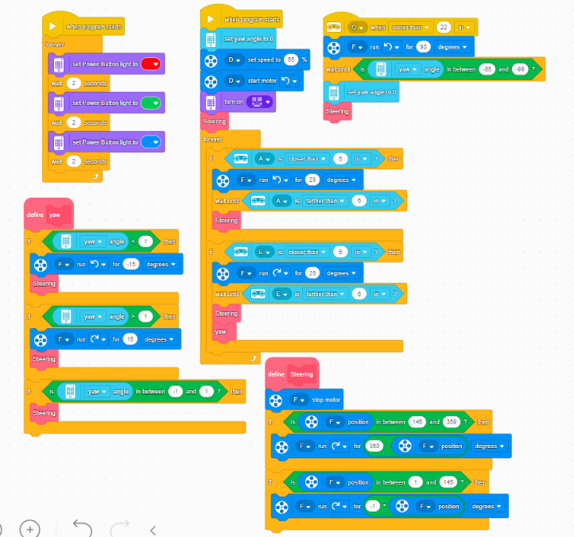
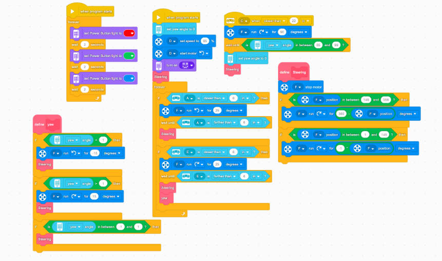
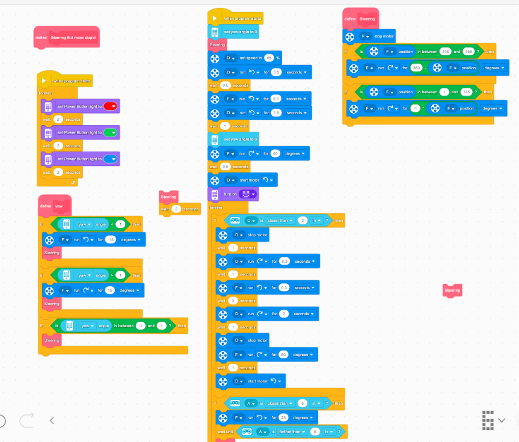
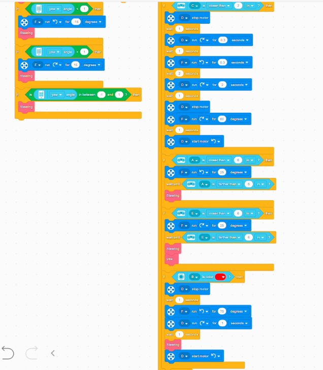

# ACTU 02 / Mayo

Capturas originales de los programas del grupo de mayo.
La numeración corresponde a las versiones que entregó el equipo.

Los proyectos editables y las exportaciones de código quedan localmente.
Las fechas de las carpetas y las de guardado se registran por separado en el inventario.

| Versión | Capturas |
|---|---|
| 01 | [Imagen 1](Version-01/code-01.png) |
| 02 | [Imagen 1](Version-02/code-01.png) |
| 03 | [Imagen 1](Version-03/code-01.png) · [Imagen 2](Version-03/code-02.png) |

## Versión 01

## Versión 02

## Versión 03

[Galería de programación](../README.md) · [Volver al inicio](../../../README.md)
