# ACTU 03 / Agosto

Capturas originales de los programas del grupo de agosto.
La numeración corresponde a las versiones que entregó el equipo.

Los proyectos editables y las exportaciones de código quedan localmente.
Las fechas de las carpetas y las de guardado se registran por separado en el inventario.

| Versión | Capturas |
|---|---|
| 01 | [Imagen 1](Version-01/code-01.png) · [Imagen 2](Version-01/code-02.png) · [Imagen 3](Version-01/code-03.png) · [Imagen 4](Version-01/code-04.png) · [Imagen 5](Version-01/code-05.png) · [Imagen 6](Version-01/code-06.png) · [Imagen 7](Version-01/code-07.png) · [Imagen 8](Version-01/code-08.png) · [Imagen 9](Version-01/code-09.png) · [Imagen 10](Version-01/code-10.png) · [Imagen 11](Version-01/code-11.png) |
| 02 | [Imagen 1](Version-02/code-01.png) |
| 03 | [Imagen 1](Version-03/code-01.png) |
| 04 | [Imagen 1](Version-04/code-01.png) |

## Versión 01

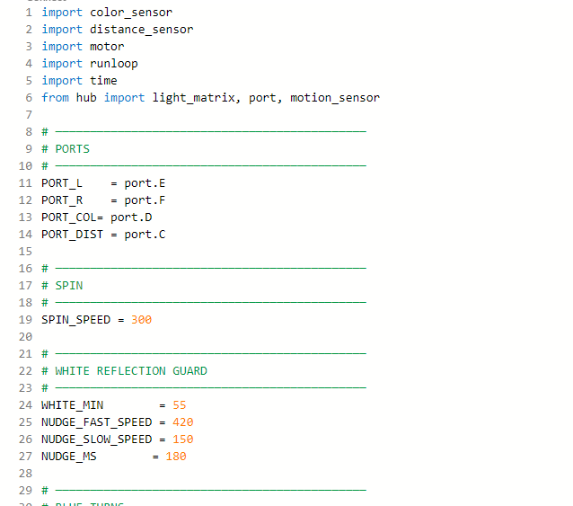

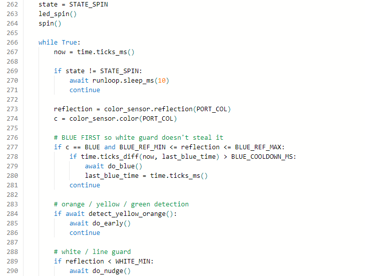

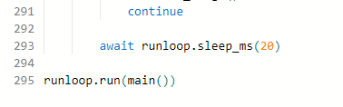

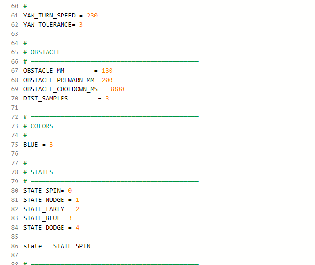

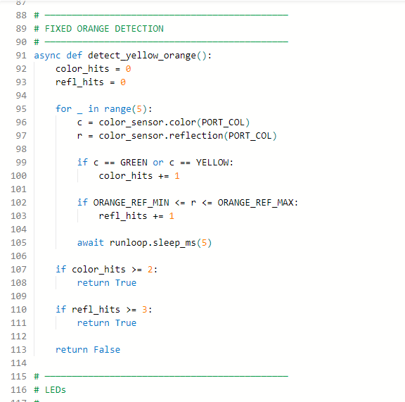

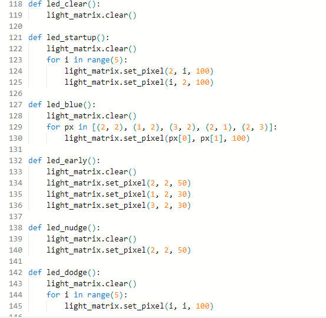

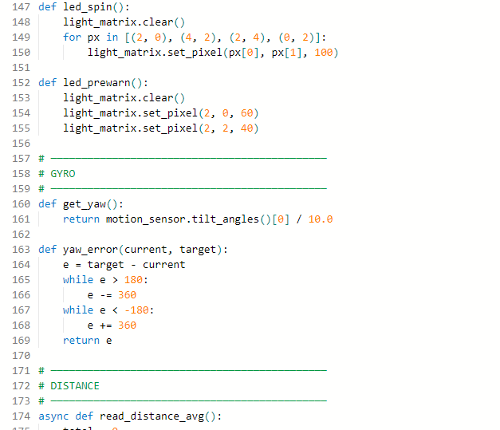

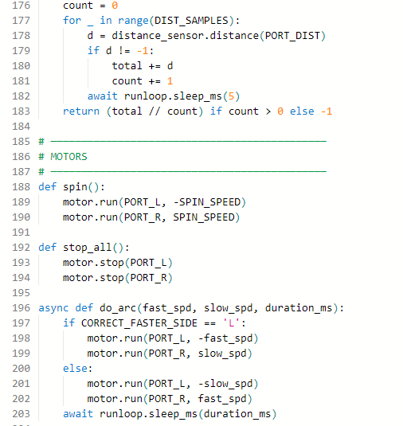

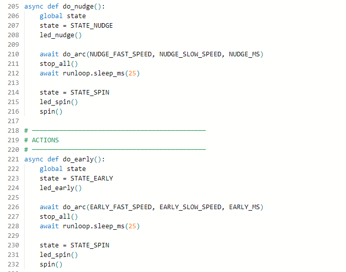

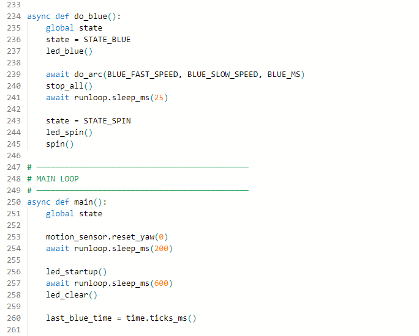

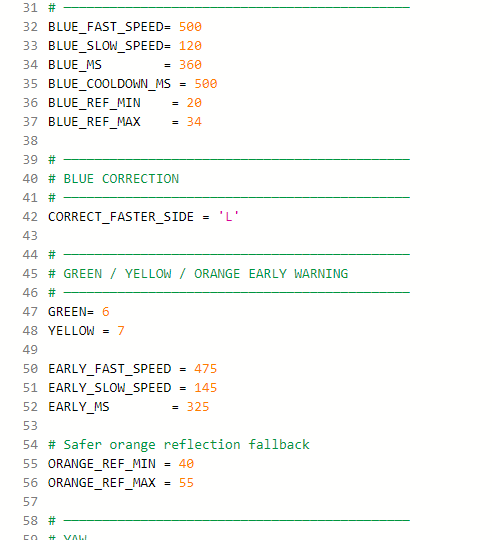

## Versión 02

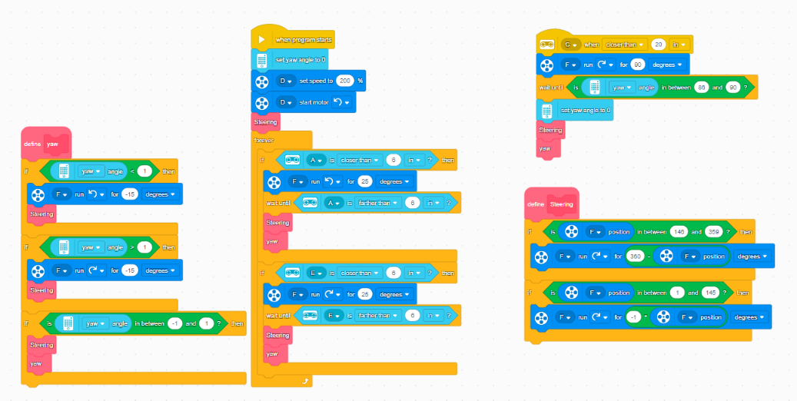

## Versión 03

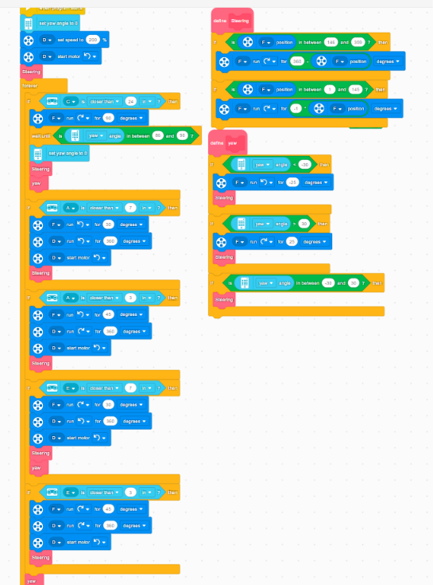

## Versión 04

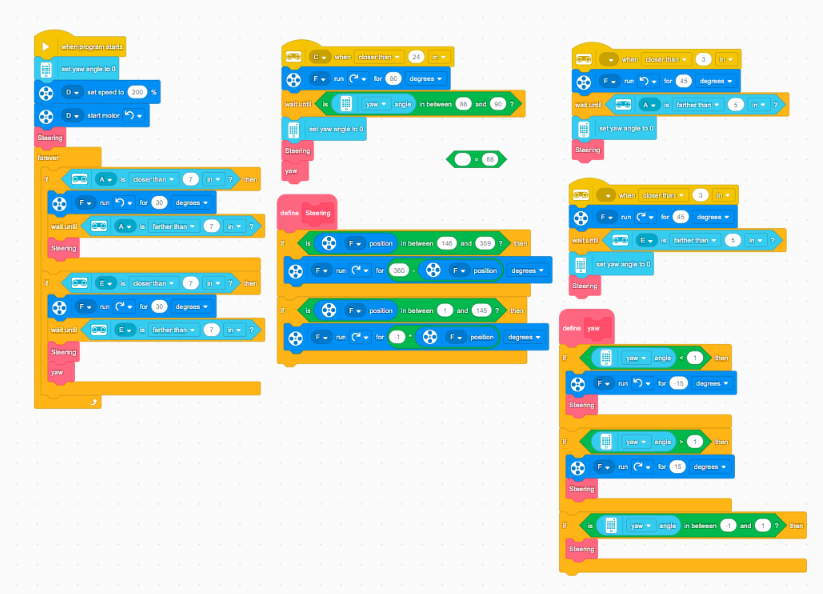

[Galería de programación](../README.md) · [Volver al inicio](../../../README.md)
