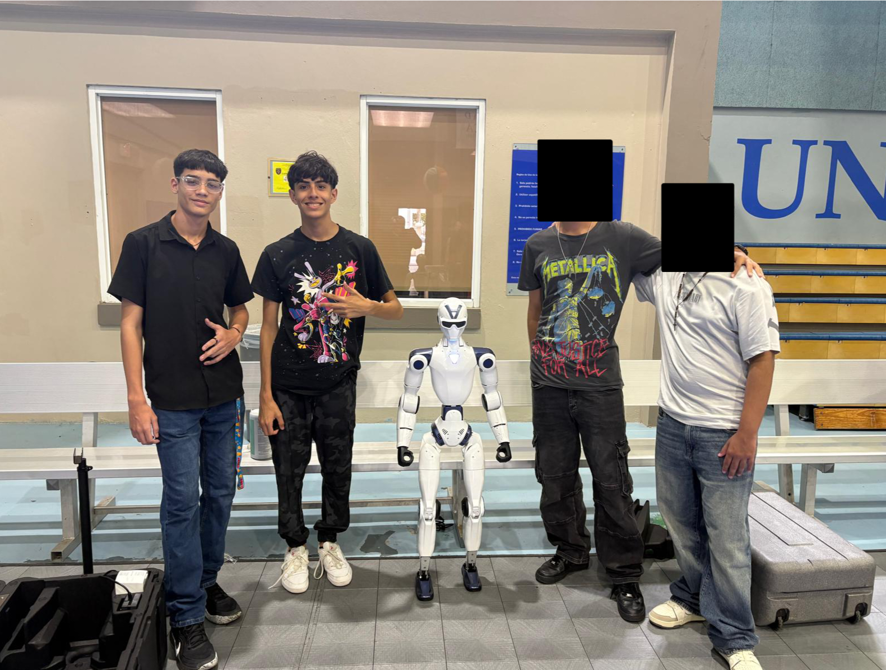
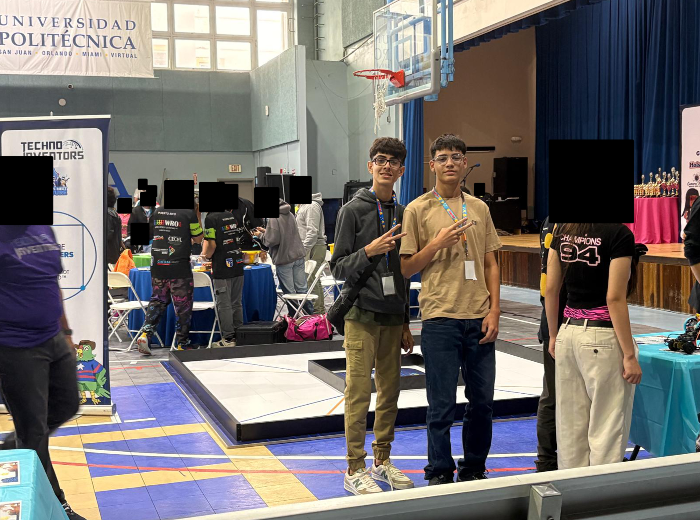
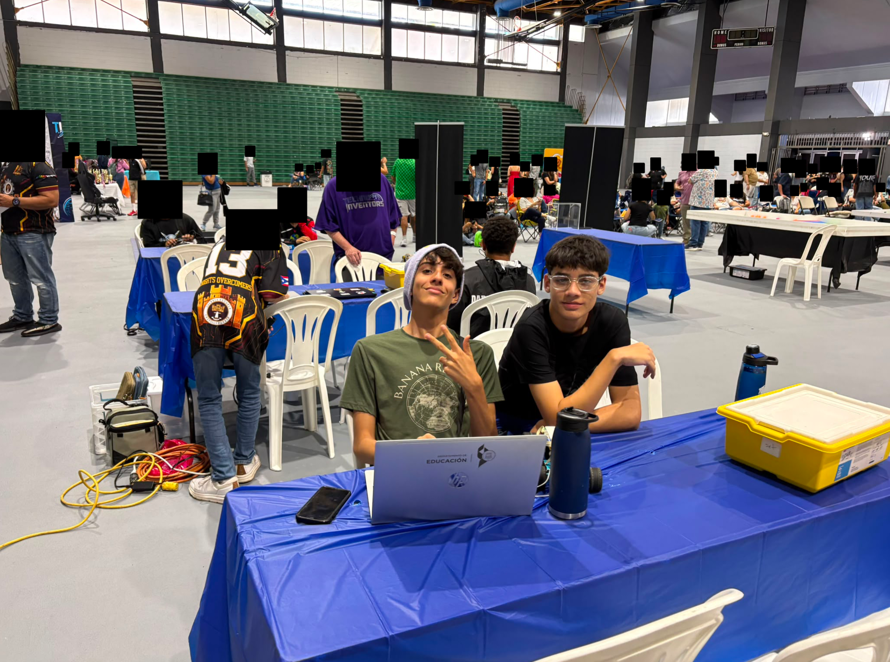
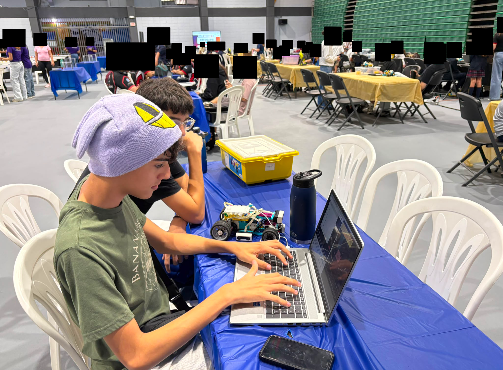
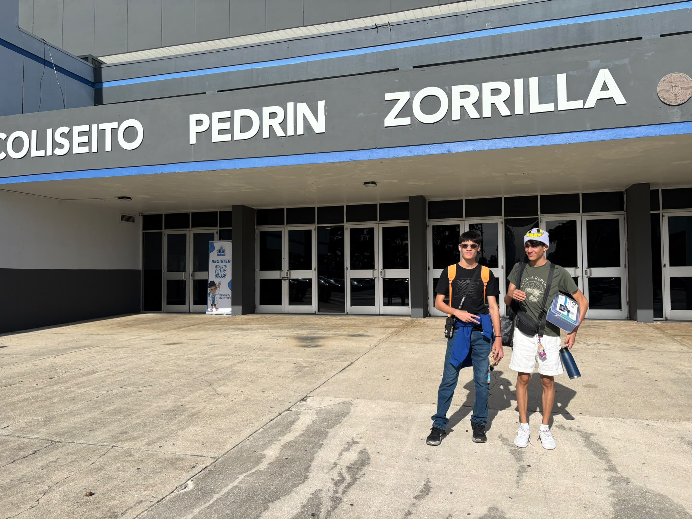
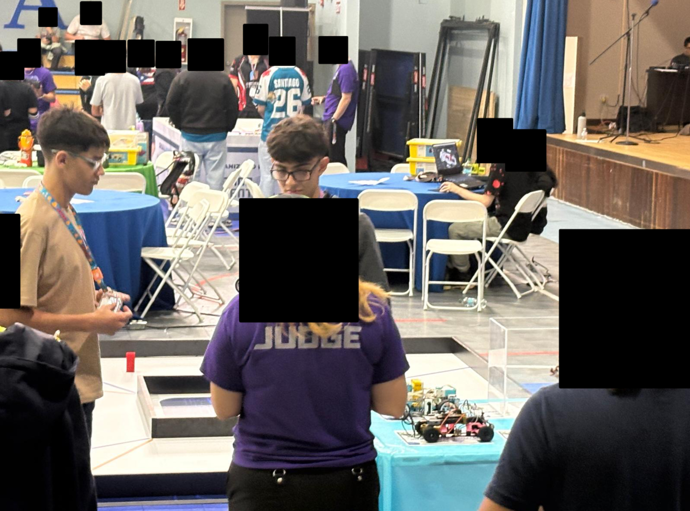
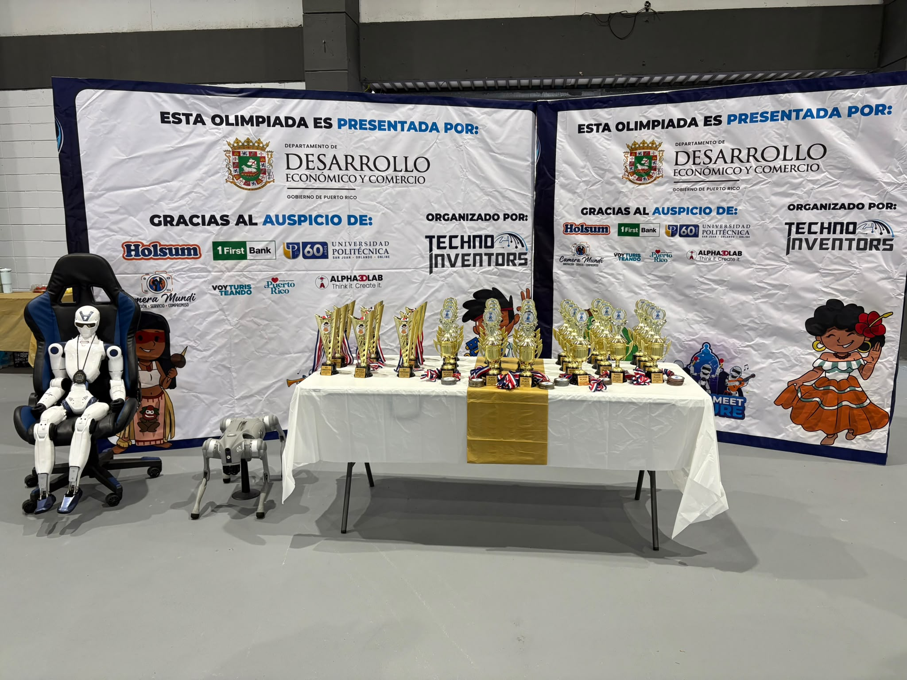
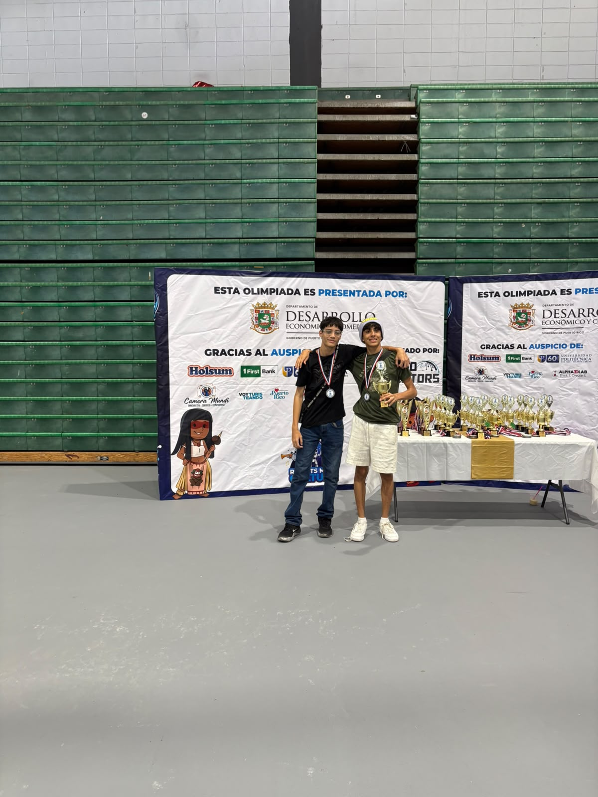

# Student Engineers / fotos del equipo

**Vocacional Manuel Méndez Liciaga · San Sebastián, Puerto Rico**

| Integrante | Responsabilidad |
|---|---|
| Adrián Iván Jiménez González | Programación |
| Carlos Elvin Cabán Martínez | Información y documentación |
| Joniel Emanuel Torres Traverzo | Diseño |

**Maestro y mentor:** Javier González Hernández.

## El equipo en las competencias

| En el evento | En la mesa de trabajo |
|---|---|
|  |  |

Estas son las fotos de eventos que entregó el equipo. Para la documentación internacional, falta confirmar o añadir una foto donde aparezcan los tres estudiantes. Las imágenes que ya tenían rostros cubiertos se conservan con esa edición original.

## Los eventos

| Coliseíto Pedrín Zorrilla | Sesión con los jueces |
|---|---|
|  |  |

| Exhibición | Equipo en la exhibición |
|---|---|
|  |  |

## Trabajo de documentación y montaje

En `Development/` se encuentran las fotos originales de abril relacionadas con la documentación. Las imágenes del carro, los sensores y los mecanismos están organizadas en [Mecánica](../Mechanics/README.md).

El [inventario de archivos](../Docs/import-manifest.json) relaciona las fotos publicadas con sus ubicaciones originales e identifica las copias repetidas.

[Libreta](../Docs/Engineering-Journal.md) · [Volver al inicio](../README.md)
