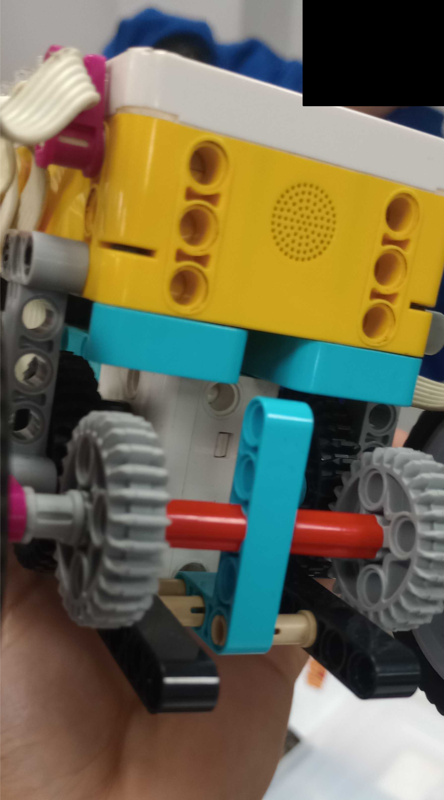
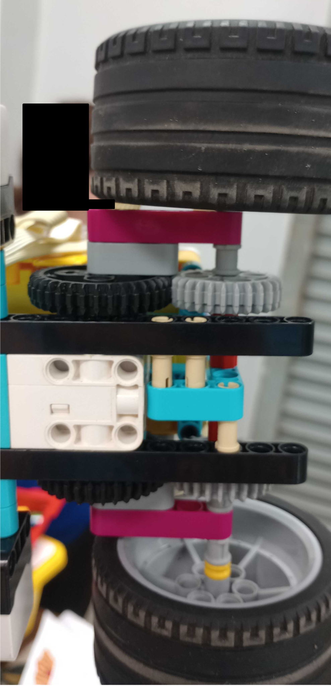
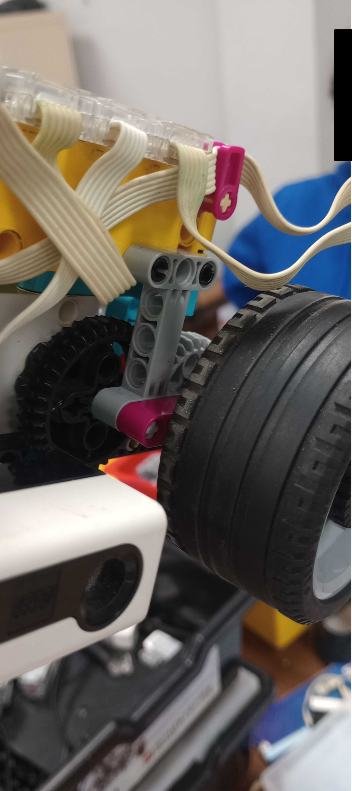

# Mechanics / ERA

## Vehicle views

[Six-view gallery](Vehicle%20Photos/README.md): front, rear, left, right, top and bottom.

## Development recorded by the team

The notebook's original concept was a compact four-wheel car with a Formula 1-inspired layout, intended to leave room for the motors and sensors. In April, a three-wheel prototype was used to simplify sensor testing. The supplied six-view set shows a four-wheel assembly.

The updated notebook records the following mechanical work:

| Date | Reported work |
|---|---|
| 30 March–2 April | Compact structural redesign for workshop testing |
| 8 April | Repositioned motors and a temporary three-wheel sensor-testing prototype |
| 23 April | Front-structure changes to improve the downward-facing colour sensor's operation |
| 29 September | Planned sensor repositioning, rear-axle mechanism and additional LEGO gearing |
| 30 September | Structural reinforcement reported as completed |
| 1 October | Further changes intended to reduce vibration in connections and maintain a straighter trajectory |

These entries describe the team's work and motivations. They do not supply a measured torque/speed comparison, gear ratio or vibration reduction percentage.

## Mechanism details

| Rear-drive detail | Underside detail |
|---|---|
|  |  |

Additional original photographs in `Development/` retain their date-based source names. The IMG_20260929 photographs document the vehicle around the late-September changes. The supplied six-view set should be confirmed against the assembly used after the 1–2 October modifications.

## Reproduction information

Recent software addresses D as the propulsion motor and F as the steering actuator. Reproduction also requires the physical axle/gearing configuration, steering-centre alignment, wheelbase, track width, wheel diameter, overall dimensions, mass and a parts list. Those measured details were not supplied.

For international participation, rules 11.1–11.5 require a four-wheel vehicle with a driving axle and steering actuator, within 300 × 200 × 300 mm and 1.5 kg. Independently driving the left and right wheels as a differential-drive base is not permitted. The archived three-wheel prototype documents a development stage and is not the international submission configuration. The connected driving axle must be checked on the actual chosen assembly.

## Model files

[3D Models](3D%20Models/README.md) records the status of CAD and manufacturing files. No model files were present in the supplied folder; photographs are not labelled as CAD.

[Journal](../Docs/Engineering-Journal.md) · [Repository home](../README.md)
