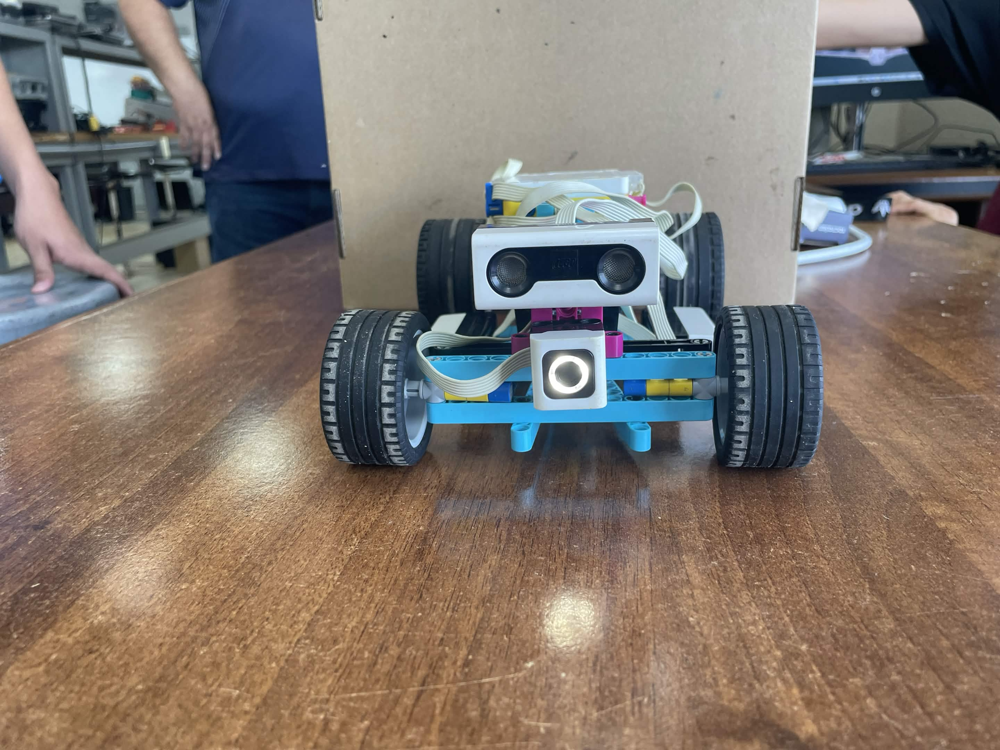
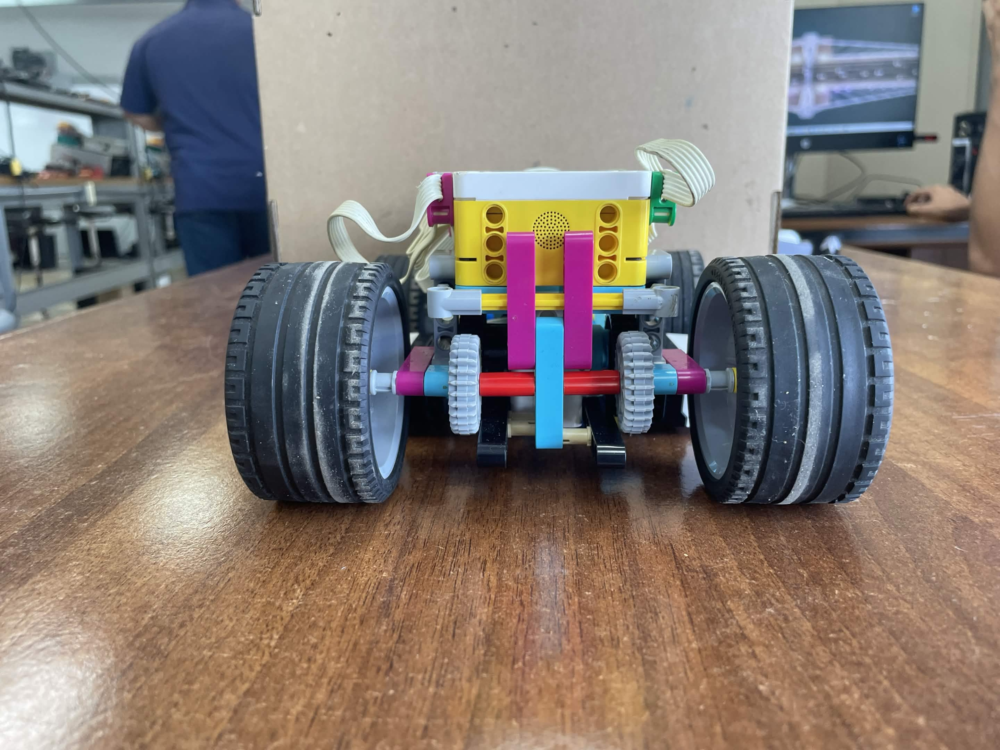
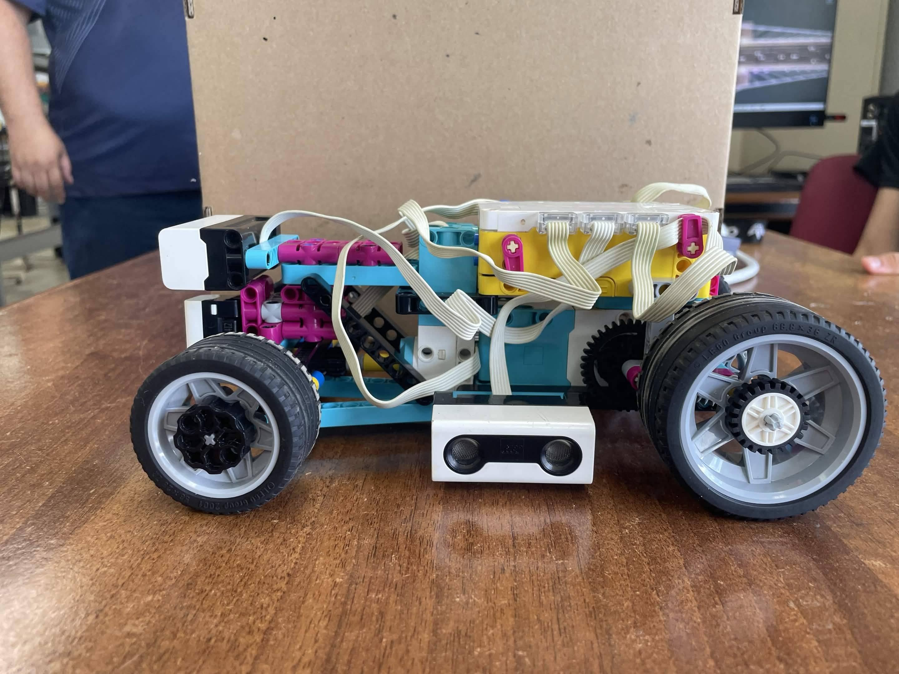
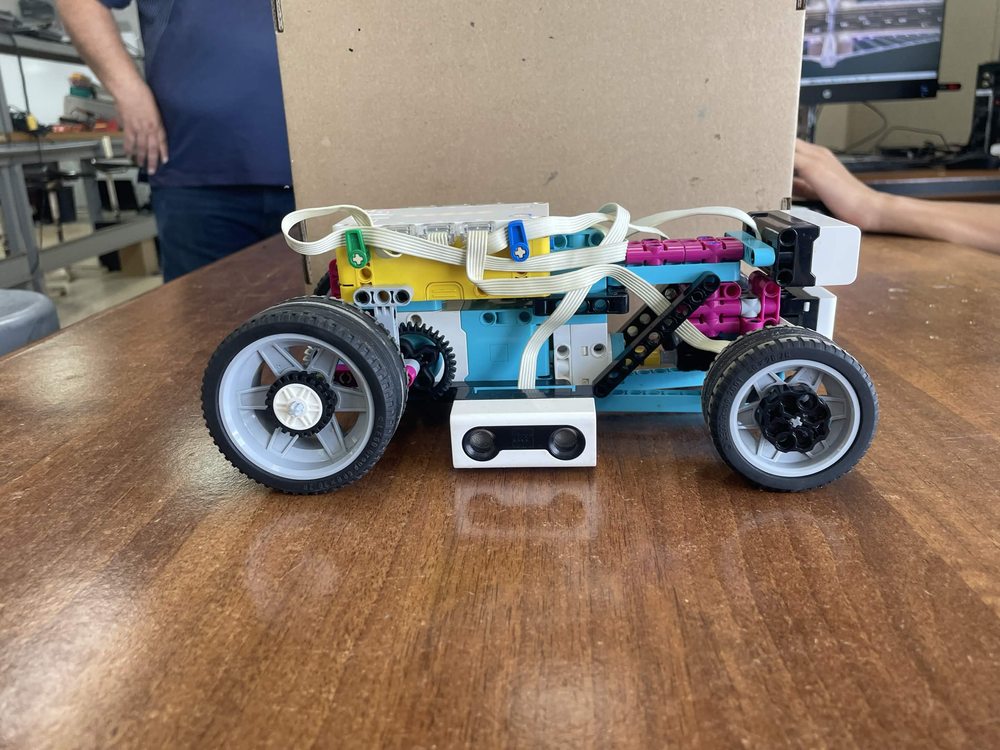
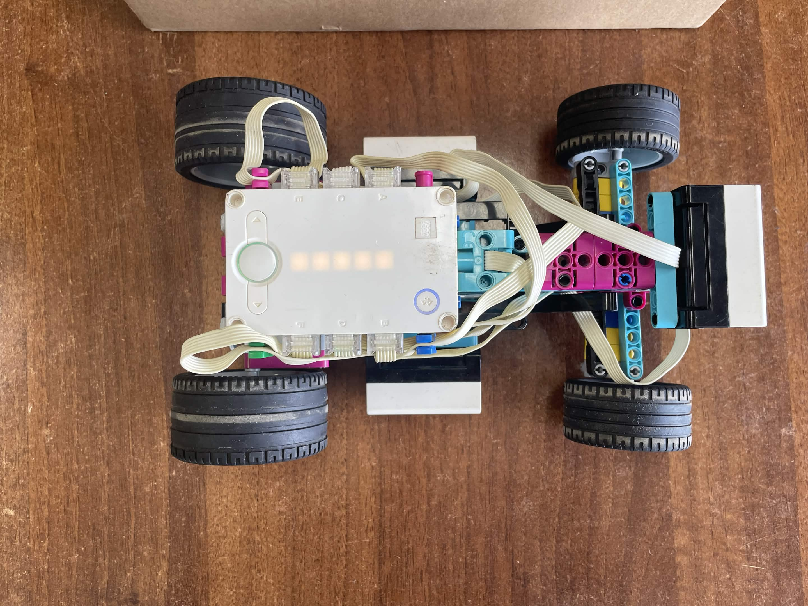
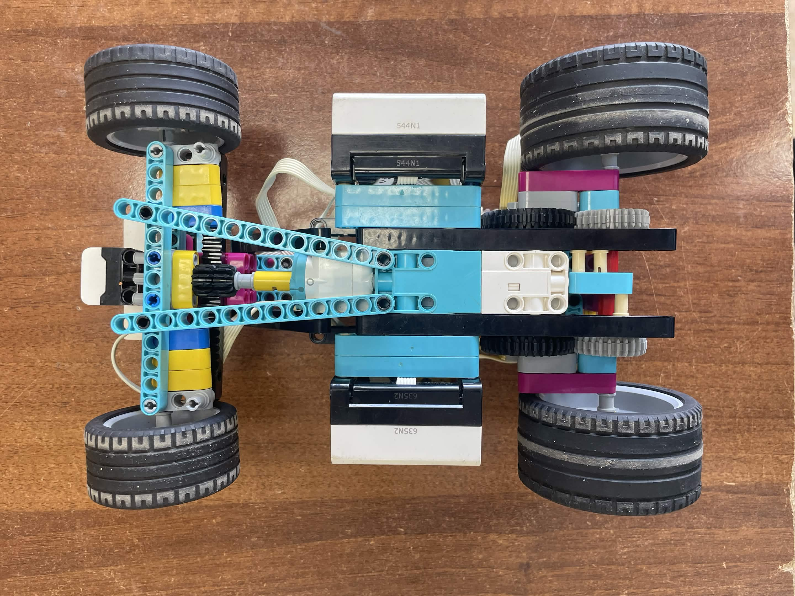

# ERA / six vehicle views

The original six named images supplied by the team. Their filenames identify the intended viewpoint. Confirm that this set represents the final assembly after the documented October modifications.

| Front | Rear |
|---|---|
|  |  |

| Left | Right |
|---|---|
|  |  |

| Top | Bottom |
|---|---|
|  |  |

[Mechanical documentation](../README.md) · [Repository home](../../README.md)
