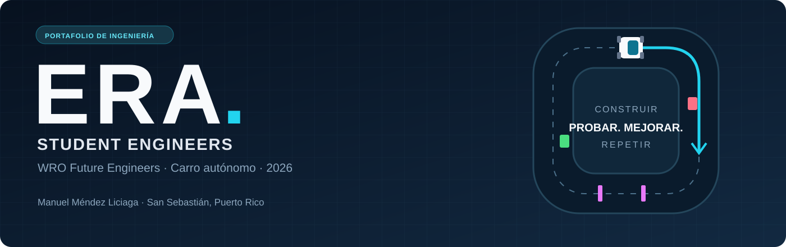
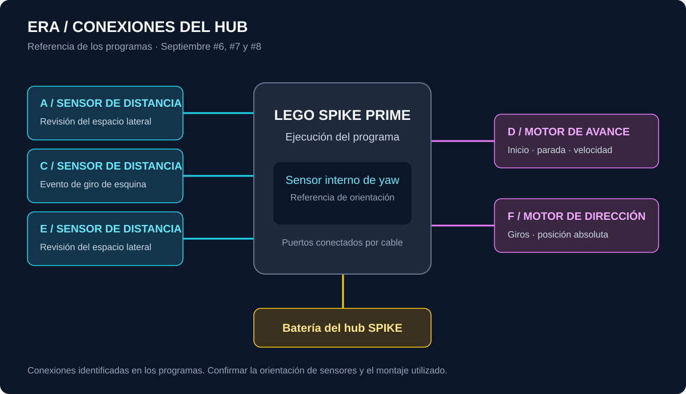
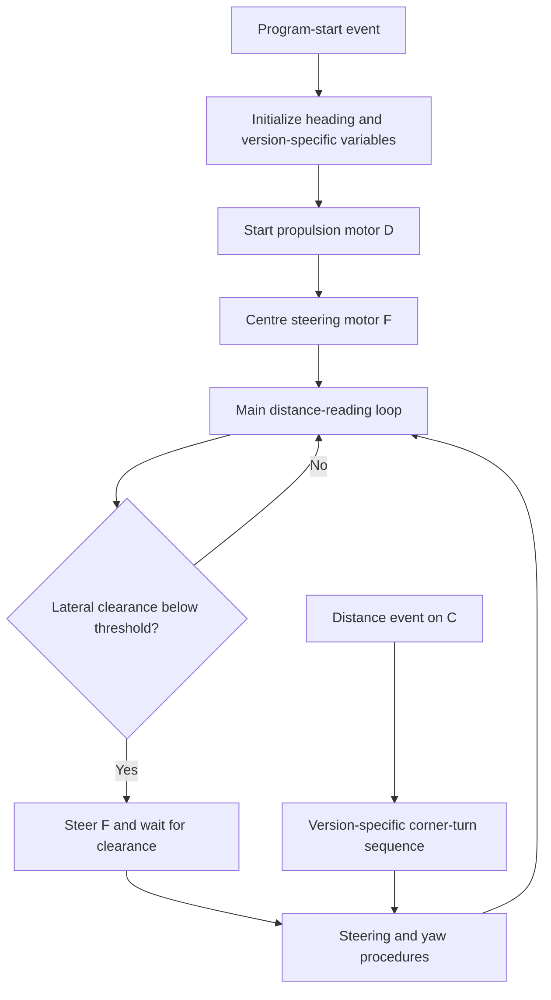

<div align="center">



# ERA · WRO Future Engineers 2026

**Los 3 Mosqueteros**<br>
Vocacional Manuel Méndez Liciaga · San Sebastián, Puerto Rico

**LEGO SPIKE Prime** · **Self-driving vehicle** · **Engineering journal**

[Software](Code/README.md) · [Electronics](Electronics/README.md) · [Mechanics](Mechanics/README.md) · [Team & gallery](General%20Photos/README.md) · [Journal](Docs/Engineering-Journal.md) · [Videos](video/video.md)

</div>

---

## 01 / Meet ERA

ERA is our LEGO SPIKE Prime vehicle developed for the **WRO Future Engineers 2026 self-driving car challenge**. This repository brings together our original programs, engineering notebook, vehicle photographs and practice recordings. It follows the development of the project from the first workshop sessions in March to the structural and software revisions documented on **2 October 2026**.

The name **ERA** represents the beginning of a new generation of robotic technology. In our notebook, the ultrasonic sensor's eye-like appearance and the vehicle's distinctive colours are described as a “canvas of innovation”: a representation of the effort, creativity and dedication of the team. The project combines mechanical construction, sensing and programming, with each iteration shaped by what we observed during practice and competition.

Our original concept was a four-wheel car inspired by the accessible layout and appearance of a Formula 1 vehicle. We briefly used a three-wheel experimental chassis in April to test the sensors and software. The photographed vehicle is a four-wheel LEGO assembly. The late-September and October journal records work on chassis rigidity, sensor positioning, a rear-axle mechanism and gearing. Earlier prototypes are retained as development evidence rather than presented as the final configuration.

<div align="center">


*ERA — front view from the supplied vehicle-photo set.*

</div>

### The team

| Team member | Responsibility recorded in the notebook |
|---|---|
| Adrián Iván Jiménez González | Programming |
| Carlos Elvin Cabán Martínez | Information and documentation |
| Joniel Emanuel Torres Traverzo | Vehicle design |
| Javier González Hernández | Teacher / coach |

The three students represent Vocacional Manuel Méndez Liciaga in San Sebastián, Puerto Rico. The coach is listed separately from the student team. The team name **Los 3 Mosqueteros** comes from the original engineering notebook; ERA is the vehicle name recorded in the updated notebook.

## 02 / Explore the project

| Section | What you will find |
|---|---|
| [Code](Code/README.md) | Original SPIKE projects, four update groups, numbered versions, screenshots and readable source exports |
| [Electronics](Electronics/README.md) | Hub connections, a source-derived connection diagram and the distinction between recent and historical port assignments |
| [Mechanics](Mechanics/README.md) | Six vehicle views, assembly details, chassis evolution and model-file status |
| [General Photos](General%20Photos/README.md) | Team photographs, event photographs and workshop documentation |
| [Docs](Docs/README.md) | Corrected original notebook, English journal, evidence, source inventory and WRO documentation references |
| [video](video/video.md) | Original practice clips and the status of the required challenge demonstration links |
| [archive](archive/README.md) | The repository's earlier notebook, README and program, plus additional original source material |

```text
WRO-Competition-Practice/
├── Code/
│   └── SPIKE Prime/
│       ├── ACTU-01-April/
│       ├── ACTU-02-May/
│       ├── ACTU-03-August/
│       └── ACTU-04-September/
├── Electronics/
│   └── Diagrams/
├── General Photos/
│   ├── Team/
│   ├── Events/
│   └── Development/
├── Mechanics/
│   ├── Vehicle Photos/
│   ├── Development/
│   └── 3D Models/
├── Docs/
├── video/
│   └── clips/
├── archive/
└── tools/
```

The folder names resemble our development workflow: code updates, electronics, general photographs and mechanics. Their contents map to the official WRO repository template without maintaining duplicate copies of the same photographs. [The documentation guide](Docs/WRO-Documentation.md) provides the template cross-reference.

## 03 / Software and hardware architecture

The control programs run on the **LEGO SPIKE Prime hub**. Original `.llsp3` files are the editable and uploadable projects. Most supplied versions use LEGO Word Blocks. The August update also contains an actual Python project; its Python source is exported directly from the original file.

For Word Blocks, the repository includes the original block graph as `.blocks.json`, a `.blocks.md` text listing of the event stacks and procedures, and the supplied screenshots. These review exports allow a reader to inspect the source without installing the LEGO application. They are not a translation of the blocks into executable Python. Program behaviour is documented from the supplied source, and the original motor values and thresholds are preserved.

### Recent versions

The team has chosen to present **all three recent numbered snapshots**, rather than label one as the definitive competition program. The original source folder is named September, but these files were saved on 2 October. Numbering and timestamps are shown separately so that the development history remains clear.

| Snapshot | Main distinction | Project | Source review |
|---|---|---|---|
| September #6 | Distance-triggered turns with yaw reset after the corner | [Open project](Code/SPIKE%20Prime/ACTU-04-September/Version-06/program.llsp3) | [Block listing](Code/SPIKE%20Prime/ACTU-04-September/Version-06/program.blocks.md) |
| September #7 | `Count` coordinates turns and straight driving; lateral thresholds are 6/7 inches | [Open project](Code/SPIKE%20Prime/ACTU-04-September/Version-07/program.llsp3) | [Block listing](Code/SPIKE%20Prime/ACTU-04-September/Version-07/program.blocks.md) |
| September #8 | `AJJHHJ` stores wrapped heading targets for successive 90° turns | [Open project](Code/SPIKE%20Prime/ACTU-04-September/Version-08/program.llsp3) | [Block listing](Code/SPIKE%20Prime/ACTU-04-September/Version-08/program.blocks.md) |

### Subsystem connections

In these recent snapshots, **motor D** is the continuously running propulsion motor and **motor F** is the steering actuator. The programs read distance sensors on **A, C and E**, and use the hub's internal yaw sensor. The recent block source does not read a colour sensor. Colour-sensor development is documented in the earlier programs and notebook, and should not be mistaken for a colour-classification routine in every recent version.

| Component / port | Role visible in the recent source |
|---|---|
| SPIKE hub | Executes the event stacks and procedures; exposes the internal yaw reading |
| D | Starts, stops and sets the propulsion motor speed |
| F | Receives steering commands; its absolute position is used for centring |
| A and E | Distance checks used by the main loop for lateral-clearance reactions |
| C | Distance event used to initiate the corner-turn sequence |
| Internal IMU | Heading measurement and correction |



The diagram describes connections referenced by the supplied software. It does not establish the exact physical orientation of each sensor or measured electrical consumption. Those details must be checked against the selected assembled vehicle. The August Python prototype uses different port assignments, which are listed in the software guide.

### Control flow



The programs are structured as event stacks and named procedures rather than separate application modules. `Steering` centres motor F using its absolute-position reading. `yaw` applies heading corrections. `PAOA` is another supplied procedure, but it has no call from the main or C-event stacks in the three recent snapshots. This distinction matters when describing what the vehicle actually executes.

The source versions differ in how they handle a corner. Version #6 resets yaw after reaching a negative-angle window. Version #7 uses `Count` to avoid overlapping turn and straight-driving actions. Version #8 updates a heading reference using angle wrapping. Its source comment describes targets of −90°, −180°, +90° and 0°; the corresponding blocks are included in the readable listing. The [software guide](Code/README.md) explains these differences and the exact original thresholds.

### Challenge strategy

The notebook records free-running practice, obstacle experiments and parking-related work at the May event. Recent snapshots demonstrate distance-based navigation and yaw control. They do not, by themselves, establish a complete colour-aware obstacle challenge: passing a red pillar on its right, passing a green pillar on its left, completing three laps and parking require separate evidence from the selected program and a full autonomous run.

The English journal preserves the team's own observations, including the damaged colour sensor, replacement sensors, work on automatic direction recognition and structural reinforcement. Reported observations are distinguished from verified source behaviour. No new lap times, success percentages, sensor measurements or competition results have been added.

## 04 / Open, upload and reproduce

1. Install the official [LEGO Education SPIKE application](https://education.lego.com/en-us/downloads/spike-app/software/). Use the application and hub firmware version appropriate for the original project. The supplied files do not record a complete tested application/firmware version pair.
2. Download or clone this repository and choose a project from the [software index](Code/README.md). Keep the project's screenshots, block listing and metadata with it.
3. Open the `.llsp3` project in SPIKE. Word Blocks projects should remain Word Blocks; the August Python project is a historical Python variant. No desktop `pip install` or standalone Python build is needed to open a Word Blocks project.
4. Compare the hub connections with the selected program. For the recent snapshots, check A/C/E for distance sensing, D for propulsion and F for steering. Centre the physical steering assembly and check that the motor's direction agrees with the selected build.
5. Connect the hub by USB and download the program to the hub. The international rules specify **only slot one** for a SPIKE competition vehicle; check the actual hub slot rather than relying only on an exported zero-based `slotIndex`.
6. During permitted practice time, check sensor readings, steering centring, turns and straight driving. Confirm how the selected version starts and stops. Keep the application disconnected and the vehicle fully autonomous during a judged run.
7. Follow the event's prescribed power-on, waiting-state and start-button procedure. The supplied recent source starts motor D on the program-start event; a separate waiting-state/start-button implementation is not established by this source export.

The photographs show the LEGO assembly and mechanism details, but complete dimensions, a measured gear ratio, a parts list and an electrical power budget were not supplied. The repository exposes the available evidence and documents these remaining reproducibility details in [the WRO documentation guide](Docs/WRO-Documentation.md).

## 05 / Engineering journey

| Period | Milestone documented by the team |
|---|---|
| March–April | Robot handover, SPIKE research, compact redesign and experimental sensor testing |
| Late April | Front-structure adjustments, colour-sensor calibration and navigation practice |
| 1–3 May | Free-running preparation and participation in the WRO event; damaged colour-sensor limitations recorded |
| August | Replacement sensors received; speed and turn-angle experiments resumed |
| 5 September | Event feedback on using one program slot and bringing the documentation up to date |
| 29–30 September | Sensor-placement planning, rear-axle/gearing work and structural reinforcement |
| 1–2 October | Further reinforcement, motion-program adjustments for Ponce and the naming of ERA |

Read the [English engineering journal](Docs/Engineering-Journal.md) for the full account. The [corrected Spanish Word notebook](Docs/Historial-de-documentacion-corregido.docx) retains the supplied document's structure. The unedited source is preserved in `Docs/Originals/`; the repository's earlier notebook is retained in `archive/pre-refresh/`.

## 06 / Vehicle, team and demonstrations

- **Six views:** [front, rear, left, right, top and bottom](Mechanics/Vehicle%20Photos/README.md).
- **Build details:** [assembly and development photographs](Mechanics/README.md).
- **Team and events:** [photo gallery](General%20Photos/README.md).
- **Practice recordings:** [video index](video/video.md).

The supplied videos are retained as original practice evidence. WRO's international documentation rules require **one YouTube link per challenge**, public or unlisted, showing at least **30 seconds of autonomous driving**. No YouTube URLs were included in the supplied files. The video index identifies the original clips and their durations so the team can choose or record the correct demonstrations.

## 07 / Documentation standard and provenance

This English README and the supporting English explanations are organised around the **2026 Future Engineers documentation rubric**: mobility and mechanical design; power and sensor architecture; software and obstacle strategy; systems thinking and engineering decisions; reproducibility and GitHub quality. The notebook's reported work is kept intact, with spelling corrections and an English presentation for review.

The public repository already contains the team's original Git history. Files labelled April, May, August or September are **source groups**, not backdated Git commits. The imported project metadata records the original save timestamps. [The import manifest](Docs/import-manifest.json) maps each supplied asset to its repository path and SHA-256 hash, including duplicate source copies. This provides traceability without filling the gallery with repeated images.

For international submission, the rules require at least three meaningful commits at the specified intervals, submission of the repository URL at least three weeks before the event, and public availability for at least twelve months afterwards. Whether the historical commits meet those deadlines depends on the actual event date; that date has not been supplied. See [WRO documentation requirements and evidence status](Docs/WRO-Documentation.md) for the details.

### References

- [WRO 2026 season and official documents](https://wro-association.org/competition/2026-season/)
- [Future Engineers 2026 General & Game Rules, chapter 7 and appendix C](https://wro-association.org/wp-content/uploads/WRO-2026-Future-Engineers-Self-Driving-Cars-General-Rules.pdf)
- [Future Engineers 2026 Documentation Rubric](https://wro-association.org/wp-content/uploads/WRO-2026-Future-Engineers-Documentation-Rubric.pdf)
- [Official WRO questions and answers](https://wro-association.org/competition/questions-answers/)
- [WRO engineering repository template](https://github.com/World-Robot-Olympiad-Association/wro2022-fe-template)

---

**Para el equipo:** la libreta original, su copia corregida y la guía breve en español están en [Docs](Docs/README.md). Las versiones recientes se muestran juntas por decisión del equipo. La documentación principal se presenta en inglés para ajustarse al requisito de la final internacional.

<div align="center">

**ERA · Build. Test. Refine.**<br>
Los 3 Mosqueteros · Puerto Rico · 2026

</div>
