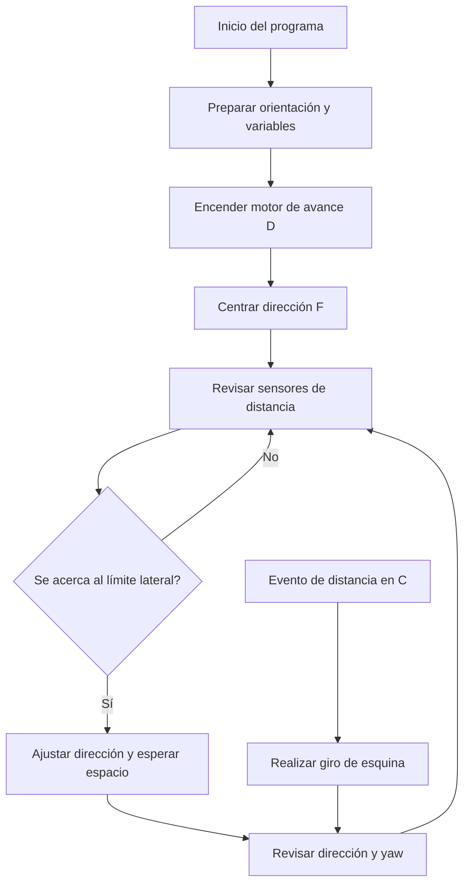

<div align="center">


# ERA · WRO Future Engineers 2026

**Student Engineers**<br>
Vocacional Manuel Méndez Liciaga · San Sebastián, Puerto Rico

**LEGO SPIKE Prime** · **Carro autónomo** · **Libreta de ingeniería**

[Programación](Code/README.md) · [Electrónica](Electronics/README.md) · [Mecánica](Mechanics/README.md) · [Fotos del equipo](General%20Photos/README.md) · [Libreta](Docs/Engineering-Journal.md) · [Videos](video/video.md)

</div>

---

## 01 / Conoce a ERA

Somos **Student Engineers**, un equipo de la Vocacional Manuel Méndez Liciaga en San Sebastián, Puerto Rico. Este repositorio reúne el trabajo que hemos realizado con **ERA**, nuestro carro autónomo para WRO Future Engineers 2026: capturas de los programas, fotos del robot, evidencia de las prácticas y nuestra libreta de ingeniería.

Aquí se puede seguir el desarrollo desde las primeras sesiones de marzo hasta los cambios de estructura y programación registrados el **2 de octubre de 2026**. Organizamos el material para que sea fácil encontrar cada versión, ver cómo fue cambiando el carro y entender las decisiones que tomamos en el taller.

El nombre **ERA** representa el comienzo de una nueva generación de tecnología robótica. Sus «ojos», formados por el sensor de ultrasonido, y sus colores llamativos nos inspiraron a describirlo como un «lienzo de innovación». Para nosotros, cada detalle del carro refleja el esfuerzo, la creatividad y el trabajo de los integrantes del equipo.

<div align="center">


*ERA — vista frontal del conjunto de fotos del robot.*

</div>

### Nuestro equipo

| Integrante | Responsabilidad |
|---|---|
| Adrián Iván Jiménez González | Programación |
| Carlos Elvin Cabán Martínez | Información y documentación |
| Joniel Emanuel Torres Traverzo | Diseño del carro |
| Javier González Hernández | Maestro y mentor |

Los tres estudiantes representamos a la Vocacional Manuel Méndez Liciaga. Nuestro maestro nos acompaña como mentor y se presenta por separado del equipo estudiantil. **Student Engineers** es el nombre del equipo; **ERA** es el nombre del robot.

## 02 / Qué vas a encontrar

| Sección | Contenido |
|---|---|
| [Programación](Code/README.md) | Capturas de los programas organizadas por actualización y versión |
| [Electrónica](Electronics/README.md) | Conexiones del hub, sensores, motores y diagrama de referencia |
| [Mecánica](Mechanics/README.md) | Las seis vistas del carro, detalles de los mecanismos y cambios de estructura |
| [Fotos](General%20Photos/README.md) | El equipo, los eventos y el trabajo en el taller |
| [Documentación](Docs/README.md) | La libreta corregida, el PDF y las referencias de WRO |
| [Videos](video/video.md) | Los cinco clips originales, sus miniaturas y duración |
| [Archivo histórico](archive/README.md) | La documentación anterior y material adicional del proyecto |

```text
WRO-Competition-Practice/
├── Code/                    Capturas de programación
│   └── SPIKE Prime/
│       ├── ACTU-01-April/     Abril
│       ├── ACTU-02-May/       Mayo
│       ├── ACTU-03-August/    Agosto
│       └── ACTU-04-September/ Septiembre
├── Electronics/             Electrónica y conexiones
├── General Photos/          Fotos del equipo y eventos
├── Mechanics/               Mecánica y fotos del carro
├── Docs/                    Libreta y documentación
├── video/                   Clips de práctica
├── archive/                 Material histórico
└── tools/                   Herramientas de verificación
```

Los nombres de las carpetas se mantienen para que los enlaces sean estables. Los títulos, las galerías y las explicaciones están en español. Las fotos repetidas en las carpetas originales se presentan una sola vez en la galería; el [inventario de archivos](Docs/import-manifest.json) conserva la relación con sus ubicaciones de origen.

## 03 / Programación: las capturas

Los programas de ERA se ejecutan en el **hub LEGO SPIKE Prime**. La mayoría de las versiones utilizan bloques de palabras de SPIKE. También contamos con un prototipo histórico en Python, presentado en las capturas de agosto.

Por decisión del equipo, **la sección de programación publica solamente las capturas**. Los proyectos editables y las exportaciones de código quedan en la PC. Las imágenes sirven para documentar el diseño de los programas; no son archivos que se puedan descargar al hub como un programa ejecutable.

Las cuatro carpetas `ACTU` corresponden a los grupos de archivos que entregó el equipo: abril, mayo, agosto y septiembre. Algunas versiones se guardaron en octubre, aunque su carpeta de origen se llame septiembre. Por eso mostramos la numeración y las fechas de guardado como datos distintos.

### Las tres versiones recientes

Presentamos **#6, #7 y #8 juntas**, tal como decidió el equipo. Cada una tiene una forma distinta de manejar los giros o las correcciones de trayectoria.

| Versión | Diferencia principal | Captura |
|---|---|---|
| Septiembre #6 | Giros activados por distancia y reinicio del yaw después de la esquina | [Ver imagen](Code/SPIKE%20Prime/ACTU-04-September/Version-06/code-01.png) |
| Septiembre #7 | La variable `Count` coordina los giros y el avance; utiliza márgenes laterales de 6/7 pulgadas | [Ver imagen](Code/SPIKE%20Prime/ACTU-04-September/Version-07/code-01.png) |
| Septiembre #8 | La variable `AJJHHJ` guarda referencias de orientación para giros sucesivos de 90° | [Ver imagen](Code/SPIKE%20Prime/ACTU-04-September/Version-08/code-01.png) |

En [la galería de programación](Code/README.md) puedes ver las tres capturas completas y entrar a las versiones anteriores. Los nombres y las fechas originales de los proyectos quedan registrados en [el inventario de versiones](Docs/software-versions.json).

## 04 / Cómo trabaja el sistema

En las versiones recientes, el programa usa el **motor D para mover el carro** y el **motor F para la dirección**. Lee sensores de distancia en los puertos **A, C y E**, además de la orientación del hub mediante su sensor interno de yaw.

| Componente | Función identificada en los programas recientes |
|---|---|
| Hub SPIKE Prime | Ejecuta los bloques y las rutinas; recibe las lecturas de los sensores |
| Motor D | Avance, parada y ajuste de velocidad |
| Motor F | Movimiento de la dirección y lectura de su posición |
| Sensores A y E | Reacciones cuando el carro se acerca al límite lateral |
| Sensor C | Evento de distancia utilizado para comenzar el giro de esquina |
| Sensor interno de yaw | Referencia de orientación y corrección del rumbo |


Este diagrama se preparó a partir de los programas suministrados. Para trabajar con el carro, hay que comparar esas conexiones con el montaje que realmente se va a usar. Las versiones antiguas tienen asignaciones distintas; por ejemplo, el prototipo Python de agosto utiliza E/F para los motores, D para el sensor de color y C para distancia.

### Flujo general



Los bloques se organizan en eventos y rutinas con nombre. `Steering` centra el motor de dirección usando su posición absoluta, mientras que `yaw` aplica correcciones de orientación. La rutina `PAOA` también aparece definida, aunque en las versiones recientes no se llama desde los bloques principales de inicio o del evento en C.

La versión #6 reinicia la orientación después de alcanzar el intervalo previsto para el giro. La #7 usa `Count` para coordinar las acciones y evitar que se interfieran. La #8 actualiza una referencia angular y contempla el cambio entre ángulos positivos y negativos al completar las esquinas.

Las versiones recientes revisadas se enfocan en distancia y orientación. El trabajo con colores, obstáculos, dirección automática y estacionamiento aparece en la historia de desarrollo del equipo. La evidencia de una tarea completa debe corresponder al programa y al montaje utilizados en esa práctica.

## 05 / El carro y sus cambios

Nuestra idea inicial fue un carro de cuatro ruedas, compacto y cómodo para trabajar en él, inspirado en la distribución de un Fórmula 1. Durante abril utilizamos un prototipo de tres ruedas para facilitar las pruebas de sensores y programación. Las fotos posteriores muestran un montaje de cuatro ruedas.

La libreta registra cambios en la parte frontal para mejorar la lectura del sensor orientado hacia el piso, pruebas de calibración y trabajo posterior en los sensores, el eje trasero y los engranajes. A finales de septiembre y principios de octubre reforzamos la estructura con la intención de reducir vibraciones y mantener una trayectoria más estable.

En [Mecánica](Mechanics/README.md) están las fotos de los mecanismos y las seis vistas: **frente, atrás, izquierda, derecha, arriba y abajo**. El equipo debe confirmar que ese conjunto de imágenes representa el montaje usado después de las últimas modificaciones.

## 06 / Nuestra trayectoria

| Período | Trabajo registrado en la libreta |
|---|---|
| Marzo y abril | Entrega del robot, investigación de SPIKE, rediseño compacto y pruebas de sensores |
| Finales de abril | Ajustes en la estructura frontal, calibración del sensor de color y prácticas de navegación |
| 1–3 de mayo | Preparación para recorrido libre y participación en la competencia; dificultades con el sensor de color rayado |
| Agosto | Recibimos sensores de repuesto y retomamos pruebas de velocidad y ángulos de giro |
| 5 de septiembre | Retroalimentación sobre el uso de un solo espacio de programa y la documentación actualizada |
| 29–30 de septiembre | Trabajo en la posición de los sensores, el eje trasero, los engranajes y el refuerzo de la estructura |
| 1–2 de octubre | Nuevos ajustes de estructura y movimiento para la competencia en Ponce; nombramos al robot ERA |

La [libreta de ingeniería](Docs/Engineering-Journal.md) presenta los registros que ya escribió el equipo. La [copia corregida en Word](Docs/Historial-de-documentacion-corregido.docx) conserva su formato, y el [PDF](Docs/Engineering-Journal.pdf) facilita la lectura y la impresión.

El documento original está guardado en `Docs/Originals/`. Los resultados y las observaciones publicados provienen de esa documentación: no añadimos tiempos de vuelta, porcentajes de éxito ni mediciones que el equipo no haya registrado.

## 07 / Fotos y videos

- **[Fotos del equipo y los eventos](General%20Photos/README.md):** nuestra participación y trabajo en las competencias.
- **[Las seis vistas de ERA](Mechanics/Vehicle%20Photos/README.md):** el carro desde todos sus lados.
- **[Detalles de construcción](Mechanics/README.md):** mecanismos, sensores y cambios del montaje.
- **[Videos de práctica](video/video.md):** cinco clips originales, con miniaturas y duración.

Las fotos mantienen su contenido original, incluyendo las imágenes que ya tenían rostros cubiertos. Los nombres descriptivos y la organización ayudan a encontrar el material sin tener que descargarlo para verlo.

Los videos se presentan como evidencia de práctica. Para la documentación internacional de WRO, se solicita un enlace de YouTube por reto, público o no listado, con por lo menos **30 segundos de conducción autónoma**. Esos enlaces todavía no venían en el material del equipo.

## 08 / Uso en el taller

1. Instala la [aplicación oficial de LEGO Education SPIKE](https://education.lego.com/en-us/downloads/spike-app/software/).
2. Consulta las capturas para identificar la versión y abre el proyecto correspondiente que el equipo conserva **localmente**.
3. Verifica los puertos, la posición de los sensores y el sentido de los motores antes de poner el carro en la pista.
4. Conecta el hub por USB para descargar el programa local. Las capturas del repositorio no sustituyen ese archivo.
5. Durante el período de práctica permitido, revisa el centrado de la dirección, las lecturas, los giros y el avance en línea recta.
6. Para una ronda oficial, sigue el procedimiento de encendido, espera y botón de inicio indicado por el organizador. La regla internacional para SPIKE especifica el uso del espacio uno.

Para reproducir exactamente el montaje también hacen falta sus dimensiones, masa, relación de engranajes, lista de piezas y datos de consumo. El repositorio presenta el material disponible y señala lo que aún necesita completar el equipo.

## 09 / Documentación y referencias de WRO

Organizamos la presentación alrededor de los cinco criterios de documentación de Future Engineers 2026: **movilidad y diseño mecánico; energía y sensores; programación y estrategia de obstáculos; decisiones de ingeniería; y reproducibilidad del proyecto**.

La presentación actual está en español y publica capturas de los programas por petición del equipo. Los requisitos internacionales también incluyen documentación en inglés y el código de control. El [estado de esos requisitos](Docs/WRO-Documentation.md) queda documentado, junto con las referencias y los plazos. Para un evento en Puerto Rico, hay que confirmar las instrucciones del organizador local.

- [Temporada WRO 2026](https://wro-association.org/competition/2026-season/)
- [Reglas de Future Engineers 2026](https://wro-association.org/wp-content/uploads/WRO-2026-Future-Engineers-Self-Driving-Cars-General-Rules.pdf)
- [Rúbrica de documentación](https://wro-association.org/wp-content/uploads/WRO-2026-Future-Engineers-Documentation-Rubric.pdf)
- [Preguntas y respuestas oficiales](https://wro-association.org/competition/questions-answers/)
- [Plantilla oficial del repositorio](https://github.com/World-Robot-Olympiad-Association/wro2022-fe-template)

---

<div align="center">

**ERA · Construir. Probar. Mejorar.**<br>
Student Engineers · Puerto Rico · 2026

</div>
