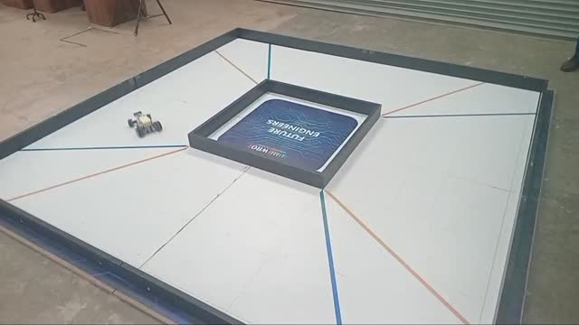
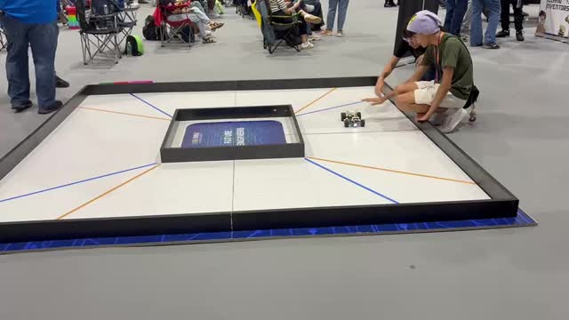
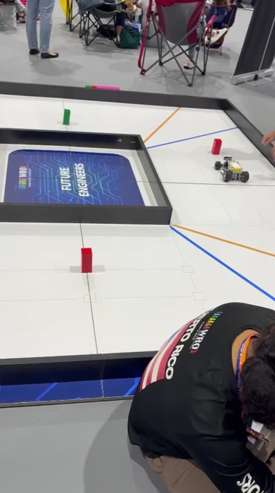
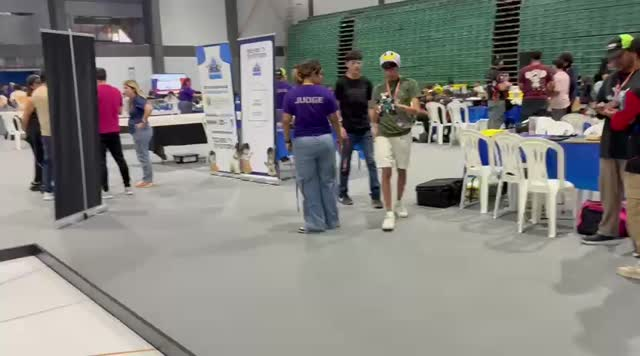
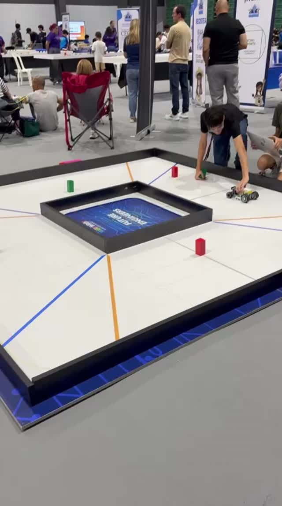

# ERA / practice recordings

Five original MP4 clips supplied by the team. Filenames below are stable repository names;
the original names and hashes remain in the import manifest. The filename dates identify
the supplied WhatsApp files, not independently verified recording dates.

## Challenge demonstrations

| Challenge | Required YouTube link |
|---|---|
| Open Challenge | Not supplied — add a public or unlisted URL |
| Obstacle Challenge | Not supplied — add a public or unlisted URL |

Chapter 7 requires one video per challenge with at least 30 seconds of autonomous driving.
The practice clips are indexed as supplied and are not labelled as successful complete rounds.
Duration alone does not prove autonomous behaviour or successful challenge completion.

## Original clips

| Clip | Duration | Original filename |
|---|---|---|
| [clip-01.mp4](clips/clip-01.mp4) | 37.37 s | WhatsApp Video 2026-10-01 at 7.42.24 PM.mp4 |
| [clip-02.mp4](clips/clip-02.mp4) | 13.70 s | WhatsApp Video 2026-10-02 at 10.01.09 AM (1).mp4 |
| [clip-03.mp4](clips/clip-03.mp4) | 11.43 s | WhatsApp Video 2026-10-02 at 10.01.09 AM (2).mp4 |
| [clip-04.mp4](clips/clip-04.mp4) | 38.47 s | WhatsApp Video 2026-10-02 at 10.01.09 AM.mp4 |
| [clip-05.mp4](clips/clip-05.mp4) | 15.80 s | WhatsApp Video 2026-10-02 at 10.01.10 AM.mp4 |

### clip-01

### clip-02

### clip-03

### clip-04

### clip-05

[Source manifest](../Docs/import-manifest.json) · [Repository home](../README.md)
